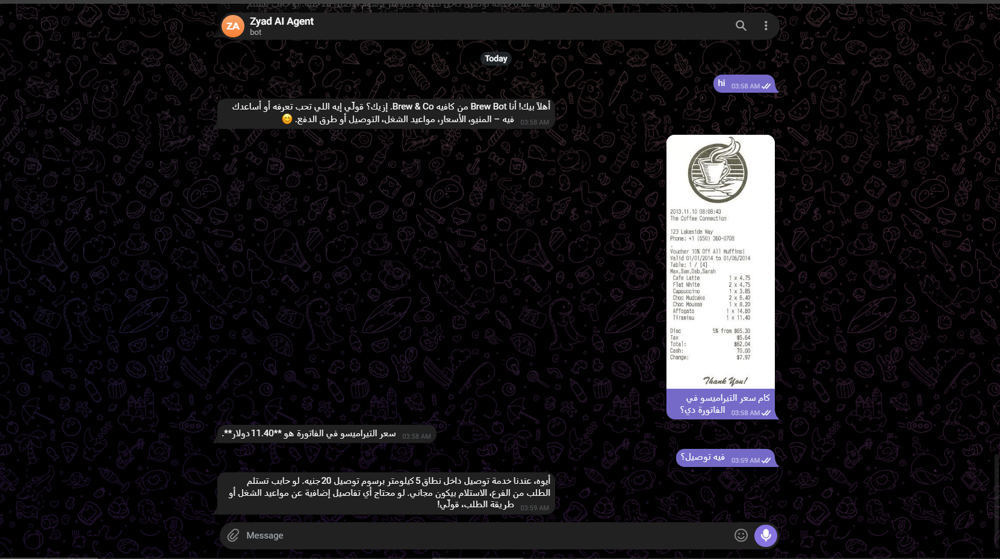

# Zyad AI Agent — Telegram Café Chatbot

An AI-powered Telegram chatbot built for a café business, capable of answering customer inquiries and reading receipts through image analysis.

## Features

- **Menu & Pricing Inquiries**: Answers customer questions about menu items and prices
- **Receipt Analysis**: Reads and extracts data from customer receipt images using AI vision
- **RAG (Retrieval-Augmented Generation)**: Uses a knowledge base for accurate, context-aware responses
- **Persistent Memory**: Remembers conversation context across sessions
- **Rate Limiting**: Prevents API abuse with built-in rate limiting

## Tech Stack

- **Language**: Python
- **Bot Platform**: Telegram Bot API
- **AI/LLM**: Gemini 1.5 Flash
- **Vision/OCR**: Image analysis for receipt reading
- **Architecture**: RAG-based knowledge retrieval

## Screenshots

## Project Structure

zyad-ai-agent/
├── agent.py          # Core AI agent logic
├── bot.py             # Telegram bot handlers
├── config.py          # Configuration and environment variables
├── database.py        # Database operations
├── evaluate.py         # Evaluation scripts
├── rag.py             # RAG implementation
├── rate_limiter.py     # API rate limiting
├── tools.py            # Helper tools (image analysis, etc.)
├── knowledge.txt        # Knowledge base for RAG
└── requirements.txt      # Python dependencies

## Installation

1. Clone the repository:
   git clone https://github.com/ZyadWael654/zyad-ai-agent.git

2. Install dependencies:
   pip install -r requirements.txt

3. Create a `.env` file with your API keys (Telegram Bot Token, LLM API key)

4. Run the bot:
   python main.py

## Author

Zyad Wael — GitHub: https://github.com/ZyadWae654
